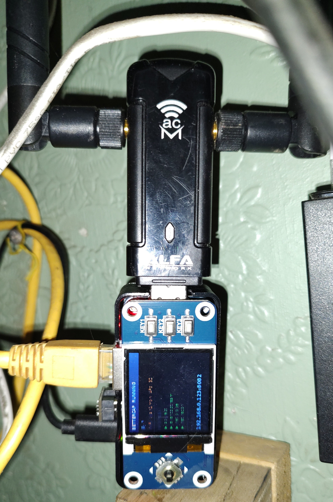
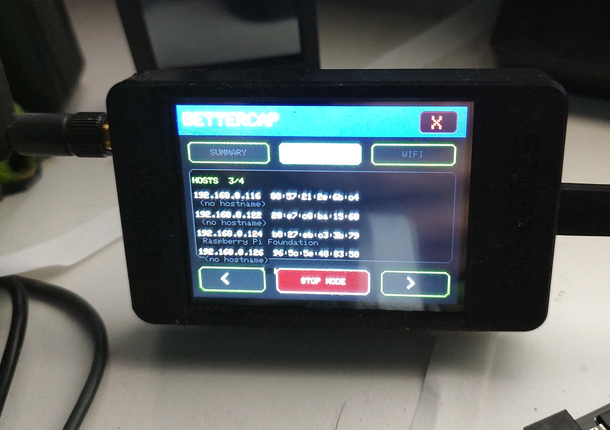
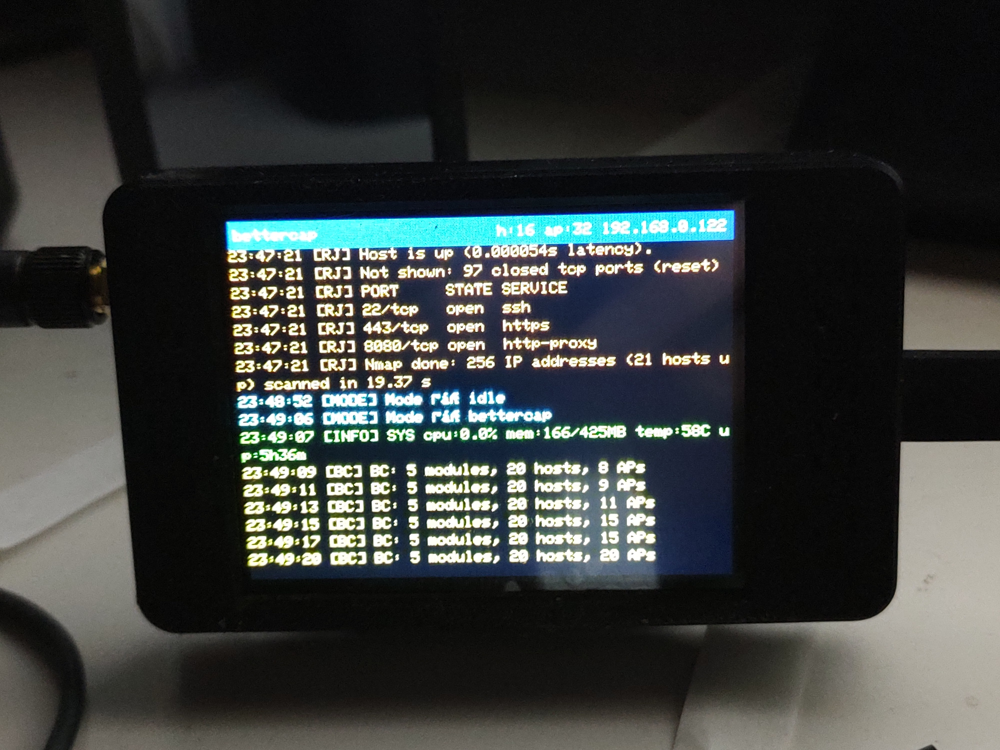

# RaspyJackProbe

`RaspyJackProbe` is a self-contained Raspberry Pi Zero 2 W network probe that combines:

- a **Waveshare 1.44" LCD HAT** for on-device boot-mode control
- a **Cheap Yellow Display (CYD)** as a live remote terminal and touch controller
- **Bettercap**, **RaspyJack**, `arp-scan`, `nmap`, and `aircrack-ng` tools behind a simple launcher
- a dedicated passive **2.4 GHz + 5 GHz Wi-Fi scanner**
- a **YouTube live streaming mode** using a USB microscope camera

The goal is to make a small, portable, offline network recon box that can be driven either from the Pi itself or from the CYD without needing a keyboard or monitor.

---

## What this project does

This project gives the Pi a boot-time mode selector and a remote control/display workflow:

- **On the Pi LCD** you can launch scan and monitoring modes directly from hardware buttons.
- **On the CYD** you get a scrolling event terminal plus touch buttons for starting/stopping modes.
- **On the network** you get a lightweight settings portal and a Bettercap dashboard.

It currently supports:

- anomaly detection using Bettercap device recon
- Bettercap passive monitoring plus optional MITM mode
- RaspyJack launch/control
- quick host discovery
- multi-host port scanning
- dedicated passive Wi-Fi AP scanning with 2.4 GHz and 5 GHz support
- **YouTube live streaming** via a USB microscope camera over RTMP

---

## Hardware layout

This repository is built around the following setup:

- **Raspberry Pi Zero 2 W**
- **Waveshare 1.44" LCD HAT**
- **Waveshare Ethernet HAT**
- **USB Wi-Fi dongle** based on **MediaTek MT7612U** for monitor-mode Wi-Fi scanning
- **USB microscope camera** (HY-3307 / Z-Star Venus, H264, 720p30) for YouTube streaming
- **ESP32 Cheap Yellow Display (CYD)** running the companion terminal UI in `CYDProbeTerminal/`

---

## Project photos

These photos are included in the repo with metadata stripped before publishing.







---

## Navigation cheat sheet

### Pi boot menu controls

| Control | Mode | What it does |
|---|---|---|
| `KEY1` | Anomaly Detector | Watches the LAN with Bettercap and alerts on changes |
| `KEY2` | RaspyJack | Launches the RaspyJack toolkit |
| `KEY3` | Bettercap Monitor | Passive LAN/Wi-Fi recon with optional MITM toggle |
| `JOY ↑` | Quick Scan | One-shot `arp-scan` host sweep |
| `JOY ↓` | Port Scan | Multi-host `nmap` scan |
| `JOY ←` | Wi-Fi Scan | Dedicated passive AP scanner with 2.4/5 GHz support |
| `JOY →` | YouTube Stream | Live streams the USB microscope camera to YouTube |
| `JOY ●` | Settings Portal | Starts the config web portal |

### Special controls

- Hold **`JOY ●`** for about 3 seconds to open the reboot confirmation flow.
- While inside **Bettercap Monitor**, **`JOY ←`** changes meaning and toggles **MITM mode** on/off.
- In scan/monitor modes, **`KEY1` / `KEY2` / `KEY3`** act as exit/back buttons.

---

## CYD interface

The CYD acts like a remote terminal and launcher for the Pi.

### Default behavior

- It shows a scrolling event log from the Pi.
- Header data includes current mode, host count, and Wi-Fi AP count.
- Tap the screen to open the touch control overlay.
- On boot, the CYD now verifies the Pi API before entering the terminal UI. If the saved Pi address/port is wrong, it drops back into the setup portal instead of silently showing a dead terminal.

### CYD control overlay buttons

- `ANOMALY`
- `RASPYJACK`
- `BETTERCAP`
- `WIFI SCAN`
- `QUICK SCAN`
- `PORT SCAN`
- `YT STREAM`
- `STOP MODE`

### Bettercap detail overlay

When the Pi is in Bettercap mode, tapping the CYD opens a dedicated Bettercap view with:

- `SUMMARY`
- `HOSTS`
- `WIFI`
- page navigation
- `STOP MODE`

This makes Bettercap much easier to read than the old single-line event flow.

---

## Mode breakdown

## 1. Anomaly Detector

This mode launches Bettercap LAN recon and uses it as a baseline watcher.

What it does:

- builds a known-device baseline
- detects new devices
- detects MAC changes
- detects disappearance spikes
- pushes alerts to the Pi LCD and CYD terminal

Related files:

- `anomaly_detector.py`
- `known_devices.json` (runtime, gitignored)
- `anomaly.log` (runtime, gitignored)

## 2. RaspyJack

Launches the existing RaspyJack toolkit on the Pi and bridges its output back to the CYD terminal.

From the CYD you can also trigger RaspyJack helper actions:

- `NET SCAN`
- `ARP SCAN`
- `PORT SCAN`
- `SHOW LOOT`
- `STOP RJ`

## 3. Bettercap Monitor

This is the main passive recon mode for LAN and Bettercap integration.

It:

- starts Bettercap with REST API enabled
- performs passive LAN recon
- can enable passive Wi-Fi recon if the secondary wireless dongle is available
- exposes a small Bettercap dashboard on port `8082`
- feeds Bettercap host/Wi-Fi data to the CYD

### MITM toggle

Inside Bettercap mode only:

- press **`JOY ←`** to switch from passive recon to MITM mode
- press **`JOY ←`** again to return to passive recon

MITM behavior is driven by `config.json` settings such as:

- `mitm_target`
- `mitm_dns_domains`
- `mitm_dns_address`
- `mitm_http_proxy`

> Use MITM features only on systems and networks you own or are explicitly authorized to test.

## 4. Quick Scan

Runs a fast one-shot `arp-scan --localnet` and displays a short result list on the Pi LCD while also pushing summary events to the CYD.

## 5. Port Scan

Collects discovered hosts and runs a broader port scan workflow against them.

This mode was updated to:

- avoid duplicate host targets
- pin scans to the best interface
- queue unique hosts more reliably on a multi-interface Pi

## 6. Wi-Fi Scan

This is the dedicated passive Wi-Fi recon mode built specifically for this project.

It uses:

- `airmon-ng`
- `airodump-ng`
- a monitor-mode interface on the USB Wi-Fi dongle

### Current scanner behavior

The Wi-Fi scanner now:

- continuously scans until you exit
- alternates focused **2.4 GHz** and **5 GHz** passes
- keeps a merged AP cache so both bands stay visible together
- reports cycle summaries such as `Cycle 2 [5G]: 24 APs (2.4G:18 5G:6)`
- shows AP counts on the CYD and Pi

Displayed AP details include:

- ESSID
- BSSID
- channel
- RSSI
- security

## 7. YouTube Stream

Streams the attached USB microscope camera live to YouTube over RTMP.

Before streaming:

1. Get a stream key from [YouTube Studio → Go Live → Stream](https://studio.youtube.com/)
2. Enter it in the **Settings Portal** (`http://<pi-ip>:8090`) under the YouTube Stream Key field
3. Press **`JOY →`** to start the stream

How it works:

- Grabs a thumbnail snapshot from the camera and displays it on the Pi LCD before starting
- Captures H264 video from the USB camera at 720p30 using `v4l2`
- Re-encodes with `libx264` (ultrafast / zerolatency preset) and injects silent AAC audio to satisfy YouTube's audio track requirement
- Applies a brightness/contrast boost (`eq=brightness=0.15:contrast=1.5:gamma=1.5`) to improve visibility in low-light conditions
- Auto-reconnects up to 5 times if the stream drops

> **Camera focus tip:** The USB microscope camera does not have autofocus. Focus and frame your shot using your PC's camera software first, then start the stream. The Pi LCD shows the snapshot taken at launch so you can verify framing.

> **Stream key note:** YouTube stream keys expire per session unless you use a persistent key. Generate a fresh key in YouTube Studio each time you start a new live session, or enable the persistent stream key option in YouTube Studio settings.

---

## Web interfaces and ports

| Port | Service | Purpose |
|---|---|---|
| `8082` | Bettercap Dashboard | Simple dark Bettercap status page |
| `8090` | Settings Portal | Edit runtime settings from a browser |
| `9090` | CYD Event/Command API | `/status`, `/events`, `/bettercap`, `/cmd` |

---

## Repository layout

```text
RaspyJackProbe/
├── anomaly_detector.py          # Bettercap-backed anomaly watcher
├── bc_dashboard.py              # Bettercap dark status UI
├── config.example.json          # Safe config template
├── mode_selector.py             # Main Pi boot menu + mode launcher + CYD API
├── port_scanner.py              # Multi-host port scan mode
├── wifi_scanner.py              # Dedicated passive 2.4/5 GHz Wi-Fi scanner
├── requirements.txt
├── systemd/
│   └── mode-selector.service
├── CYDProbeTerminal/
│   ├── include/Events.h         # Pi API client/cache for CYD
│   └── src/main.cpp             # CYD terminal UI + touch controls
└── README.md
```

Runtime files that should **not** be committed are ignored in `.gitignore`, including:

- `config.json`
- `known_devices.json`
- `anomaly.log`
- `CYDProbeTerminal/.pio/`
- generated `.pcap`, `.csv`, and `.log` artifacts

---

## Installation

## 1. Pi dependencies

Install the main packages used by this project:

```bash
sudo apt update
sudo apt install -y bettercap arp-scan aircrack-ng nmap ffmpeg fswebcam
pip install -r requirements.txt
```

## 2. Clone and configure

```bash
git clone https://github.com/Coreymillia/RaspyJackProbe.git /root/RaspyJackProbe
cd /root/RaspyJackProbe
cp config.example.json config.json
```

## 3. Enable the mode selector service

```bash
sudo cp systemd/mode-selector.service /etc/systemd/system/
sudo systemctl daemon-reload
sudo systemctl enable mode-selector.service
sudo systemctl start mode-selector.service
```

## 4. Bettercap service

Bettercap ships with its own service file. This project starts and stops Bettercap as needed, but enabling the unit is still useful:

```bash
sudo systemctl enable bettercap.service
```

---

## Configuration

Edit settings through the **Settings Portal** or directly in `config.json`.

| Field | Default | Description |
|---|---:|---|
| `mitm_target` | `""` | Target IP for ARP spoof / MITM |
| `mitm_dns_domains` | `""` | Comma-separated DNS hijack list |
| `mitm_dns_address` | `""` | Redirect address for spoofed DNS |
| `mitm_http_proxy` | `false` | Enable HTTP proxy interception |
| `ip_forward_persistent` | `false` | Persist IP forwarding across boots |
| `anomaly_poll_interval` | `30` | Seconds between anomaly polls |
| `anomaly_spike_threshold` | `3` | Device spike alert threshold |
| `youtube_stream_key` | `""` | YouTube RTMP stream key for Mode 7 |

---

## Building and flashing the CYD

The CYD firmware lives in `CYDProbeTerminal/`.

Build:

```bash
pio run -d CYDProbeTerminal
```

Flash:

```bash
pio run -d CYDProbeTerminal -t upload --upload-port /dev/ttyUSB0
```

If the CYD is on Wi-Fi but does not receive events or control the Pi, reconnect it to the setup portal and confirm the Pi address/port. For this probe, the live Pi API is currently responding at `http://192.168.0.123:9090/status`.

---

## Operational notes

- The Pi LCD is the local launcher.
- The CYD is the remote terminal and touch control panel.
- Bettercap mode is best for LAN/device visibility and optional MITM workflow.
- The dedicated Wi-Fi scanner is best when you want clearer AP-focused recon, especially across both bands.
- The project is intentionally **offline-first** and does not depend on cloud services.

---

## Safety

This project includes network recon and optional MITM capabilities.

Only use it on:

- your own equipment
- your own networks
- environments where you have explicit permission

Do **not** use these features on networks or devices you do not control.

---

## Status

At this point, the project includes:

- working Pi boot menu navigation
- CYD terminal/control integration
- Bettercap LAN monitoring
- Bettercap CYD detail views
- working quick scan and port scan
- working anomaly detector
- working dedicated Wi-Fi scanner with 2.4 GHz and 5 GHz visibility
- **YouTube live streaming via USB microscope camera (Mode 7, JOY →)**

It started as a compact probe box and is now a usable multi-mode portable network toolkit with live streaming capability.
